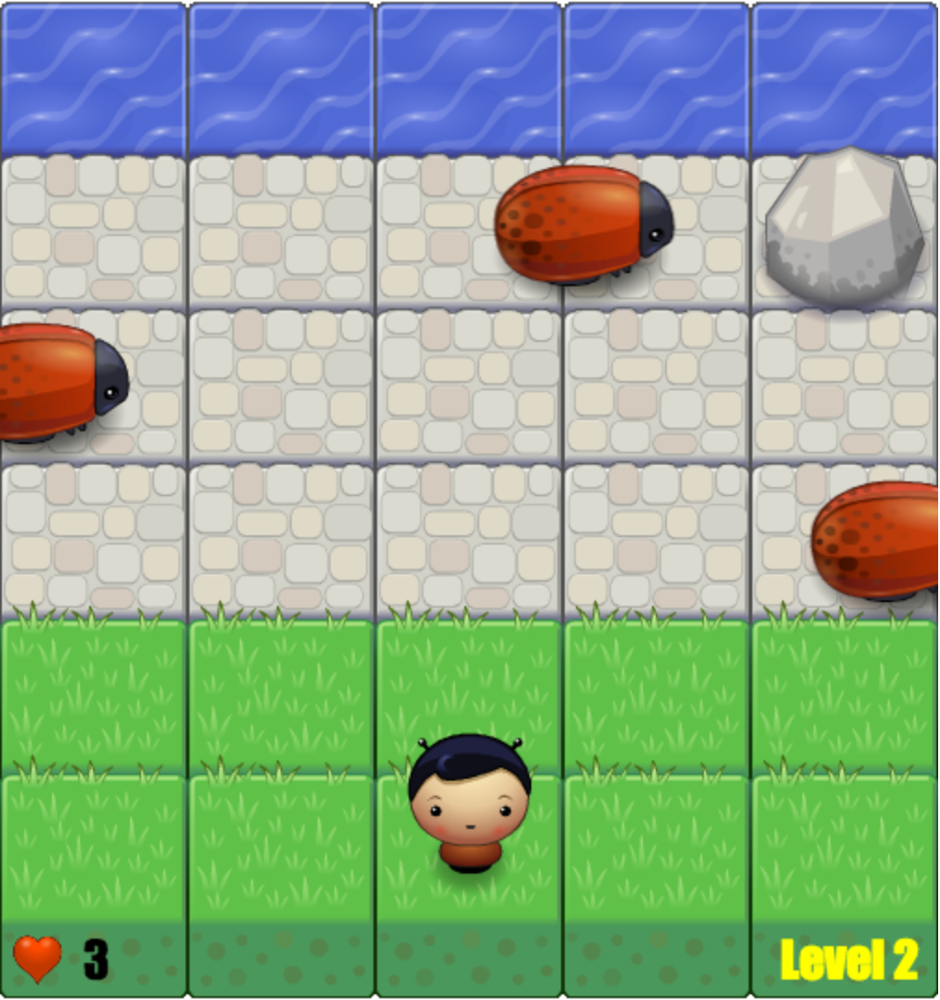

前端纳米学位街机游戏克隆项目
===============================

##  启动游戏

可以通过任意HTTP服务器启动游戏，比如使用Node HTTP Server：

```bash
bash
npm install -g http-server
http-server ./arcade-game-clone/ -p 8000 
```

然后访问`http://localhost:8000/`即可开始游戏。

## 游戏规则

如图所示，玩家控制人物移动到对岸即可通过当前关卡（level）。总共有五个关卡，全部通过即可获取游戏胜利。

玩家需避开虫子和石头，被虫子碰到就会丧失一条命。玩家总共有三条命，全部丢完则游戏结束。

</img>

## 基本操作

* 方向键上下左右控制人物
* 游戏结束时按回车键重新开始游戏

